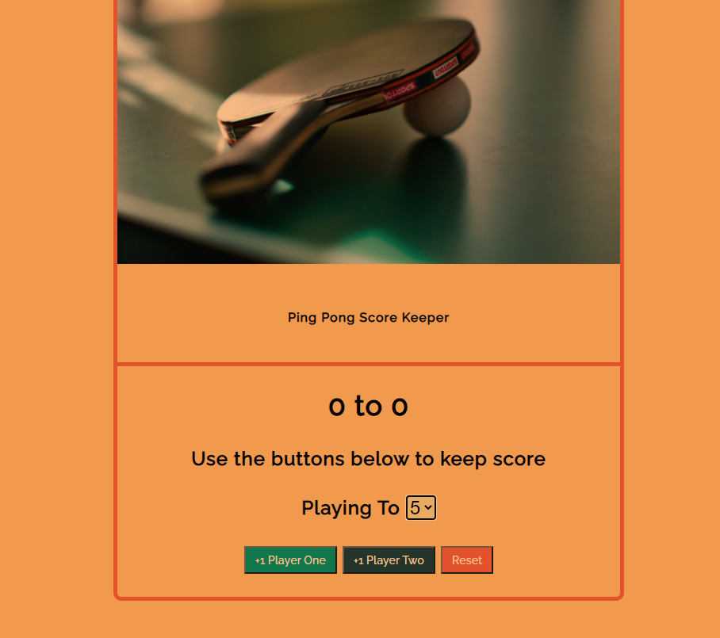
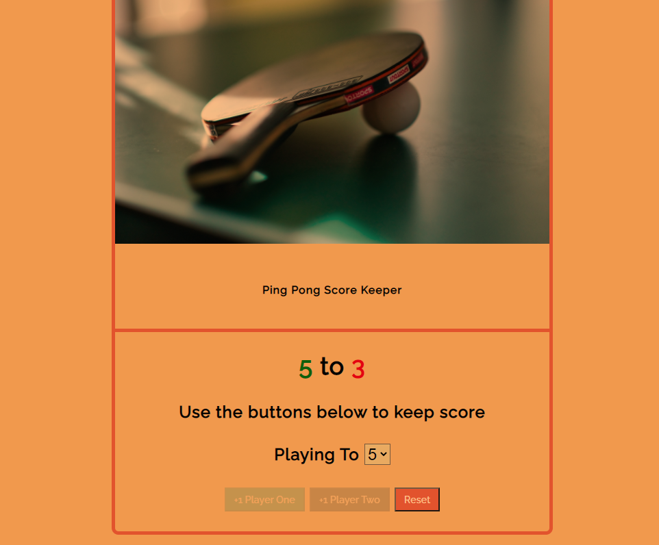

## ScoreKeeper

## Summary

This is a small scorekeeper app made with vanilla JS. It allows users to choose a score to play up until, and will end the game when someone reaches that number. There is also a reset button to enable the buttons to work and starts the scores at zero again.

 

 

 

This is one of a few vanilla JS projects that I've been making to solidify core JS concepts and familiarize myself with more built-in methods.

 

 

  
  

**Author**
 
**Robin Fussell** _- Software Developer_ | [LinkedIn](https://www.linkedin.com/in/robin-fussell17/)